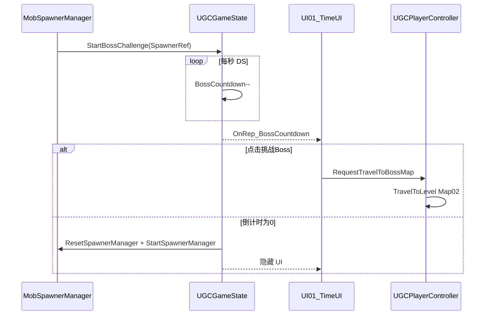

# 方案 A 详细实施步骤（独立地图）

**地图约定**：小怪关 `/demo1/Map01`（默认启动），Boss 关 `/demo1/Map02`（与现有 [`UI01.lua`](Script/Blueprint/UI/UI01.lua) 一致）。若项目内地图名不同，全局替换常量即可。

**数据流**：



---

## 1. 编辑器操作步骤

### 1.1 地图与玩法框架

| 步骤 | 面板 / 菜单 | 具体操作 |
|------|------------|---------|
| 1.1.1 | **内容浏览器** → 右键 **关卡** | 确认或新建 `Map01`（小怪关）、`Map02`（Boss关）；两图场景互不连接 |
| 1.1.2 | **玩法上传 / 模式配置**（或 `Asset` 下 `UGCGameModeConfig` 数据表） | 将 **默认启动地图** 设为 `Map01` |
| 1.1.3 | **内容浏览器** → 打开 `UGCGameMode` 蓝图 | **Class Settings** 确认父类为 `BP_UGCGameBase`；**Lua 脚本** 绑定 `Script/Blueprint/UGCGameMode.lua` |
| 1.1.4 | `UGCGameMode` → **详细信息** → `GMDataManager` | 配置 **LevelDirector** 引用为 `BP_CustomLevelDirector`（见 1.1.5） |
| 1.1.5 | **内容浏览器** → 右键 **蓝图类** | 若尚无：创建 `BP_CustomLevelDirector`，父类选项目 LevelDirector 基类；绑定 Lua：`Script/gamemode/BP_CustomLevelDirector.lua` |
| 1.1.6 | **内容浏览器** → 打开 `UGCGameState` 蓝图 | 绑定 Lua：`Script/Blueprint/UGCGameState.lua` |
| 1.1.7 | **内容浏览器** → 打开 `UGCPlayerController` 蓝图 | 绑定 Lua：`Script/Blueprint/UGCPlayerController.lua`；确认 **Input Mapping Preset** 已配置（火焰技能按键见 1.5） |
| 1.1.8 | **Map01 关卡编辑器** | 放置 **玩家出生点**（Player Start）；确保 GameMode 为 `UGCGameMode` |
| 1.1.9 | **Map02 关卡编辑器** | 放置 Boss 出生点/玩家出生点、Boss 怪物刷新点（见 1.3，Boss 用 `UGC_BOSS_Generic_HealthBar_UIBP`） |

### 1.2 小怪：感知、行为、血条

| 步骤 | 面板 / 菜单 | 具体操作 |
|------|------------|---------|
| 1.2.1 | **实体编辑器** / **内容浏览器** → 右键蓝图 | 创建或打开小怪蓝图（如 `BP_MyMob`），父类 **`STExtraSimpleCharacter`** |
| 1.2.2 | 小怪蓝图 → **Lua** | 绑定 `Script/Blueprint/AI/MyAI.lua`；AIController 类设为 `MyAIController`（绑定 `MyAIController.lua`） |
| 1.2.3 | 小怪蓝图 → **详细信息** → **Entity Type** | 设为 `EntityType.Monster` |
| 1.2.4 | 小怪蓝图 → **组件** → **怪物逻辑管理组件** | 启用 `BP_UGCTargetProducer_EnemyHatred`：**寻敌感知半径 = 500**（5米）；可选勾选 **锁定玩家时显示** 血条 |
| 1.2.5 | **内容浏览器** → 右键 **用户控件** | 继承 `UGC_NPC_Generic_HealthBar_UIBP` 创建 `WBP_MobHealthBar`，按需改样式后 **编译保存** |
| 1.2.6 | 小怪蓝图 → **Health Bar** | **控件蓝图路径** = `WBP_MobHealthBar`；**实时显示最大距离 CM** = 3000~5000；**受击后显示** 可勾选 |
| 1.2.7 | 小怪蓝图 → **属性** | 配置 `Health` / `HealthMax`（通用属性系统）；配置攻击技能（`UAESkillManager`，参考 `126_让怪物释放技能进行攻击.md`） |
| 1.2.8 | **内容浏览器** → 行为树 | 打开 `MyBehaviortree`（或 `BT_UGC_GenericMob_MainTree` 副本）：寻敌节点目标类型 = **`UGCPlayerPawn`**，黑板变量 `Target` |
| 1.2.9 | **Map01 关卡编辑器** | 放置 **AI World Volume** 覆盖 playable 区域；**导航网格** 烘焙（GameMode 开启 `ESS_Navigation` / 怪物寻路组件） |

### 1.3 刷怪管理器（Map01）

| 步骤 | 面板 / 菜单 | 具体操作 |
|------|------------|---------|
| 1.3.1 | **内容浏览器** → 右键 **蓝图类** | 继承 `BP_UGCMobSpawner` 创建刷新点，拖入 Map01 各刷怪位置 |
| 1.3.2 | 刷新点实例 → **详细信息** | **怪物配置模式** = 蓝图配置；**怪物蓝图** = `BP_MyMob`；**SpawnerContrMode** = 管理器控制 |
| 1.3.3 | **内容浏览器** → 右键 **蓝图类** | 继承 `BP_UGCMobSpawnerManager` 创建 `BP_MobSpawnerManager`；绑定 Lua：`Script/gamemode/BP_MobSpawnerManager.lua` |
| 1.3.4 | `BP_MobSpawnerManager` → **详细信息** | **StartCondition** = 关卡加载 或 手动调用；**SpawnWaves** 配置一波，引用 1.3.1 刷新点；**WaveStartCondition** = 关卡加载 |
| 1.3.5 | **Map01** | 拖入 `BP_MobSpawnerManager` 实例；**编译保存地图** |

### 1.4 主界面 UI（倒计时 + 挑战 Boss）

| 步骤 | 面板 / 菜单 | 具体操作 |
|------|------------|---------|
| 1.4.1 | 打开 **`UI01`** UMG（`Asset/Blueprint/UI/UI01`） | 绑定 Lua：`Script/Blueprint/UI/UI01.lua` |
| 1.4.2 | **UMG 设计器** | 确认控件：`BossButton`（按钮）、`Bosstext`（可选提示）、`TimeUI`（子控件，类型 `TimeUI`） |
| 1.4.3 | `TimeUI` UMG | 绑定 `Script/Blueprint/UI/TimeUI.lua`；确认 `LastTime`（`UTextBlock`）用于显示秒数 |
| 1.4.4 | **UMG** | 初始状态：`BossButton`、`TimeUI` **Collapsed/Hidden**（由 Lua 在清关后显示） |
| 1.4.5 | **模式编辑器**（可选） | 若使用 `updateUI` Action 加载 UI，与 `UGCGameState` 二选一，避免重复 `AddToViewport`（推荐仅保留 GameState 加载） |

### 1.5 火焰范围技能（5m / CD 2s）

| 步骤 | 面板 / 菜单 | 具体操作 |
|------|------------|---------|
| 1.5.1 | **技能编辑器** → 打开 `BP_MyFireSkill` | 绑定 Lua：`Script/Blueprint/Prefabs/Skills/BP_MyFireSkill.lua` |
| 1.5.2 | 技能 → **BaseData** | **Interval = 2**（CD）；**NeedSync** 按需勾选 |
| 1.5.3 | 技能阶段 → 添加 Task | **生成法术场** → 模板选 **伤害场**；法术场 **SphereCollision 半径 = 500** |
| 1.5.4 | 法术场内伤害 Task | 目标过滤含 `EntityType.Monster`；配置伤害数值 |
| 1.5.5 | **编译保存** 技能 | 记录 **SkillArchetypes 中的 SkillIndex**（下文代码用常量 `FIRE_SKILL_INDEX`，示例 120） |
| 1.5.6 | `UGCPlayerPawn` 蓝图 → **UAESkillManager** | `SkillArchetypes` 引用 `BP_MyFireSkill`；`Skill Entry Configs` 增加条目（Entry 如 `SkillEntry_CommonDown`，SkillIndex 与 Archetypes 一致） |
| 1.5.7 | `UGCPlayerController` → **Input Mapping Preset**（`DA_UGCInputMapping`） | 新增操作映射：按键（如 Q）→ 自定义 GameplayTag；Lua 中 `UGCInputSystem.InjectInputMapping` 或 `UGCPlayerPawn` 内 `TriggerEvent`（见 3.7） |

### 1.6 玩法通用（血条上限等）

| 步骤 | 面板 / 菜单 | 具体操作 |
|------|------------|---------|
| 1.6.1 | **玩法通用设置** / `DA_GameModeGeneral` | **血条显示最大数量** 按需调大；开启伤害飘字（可选） |

---

## 2. Script/ Lua 类清单

| 类名（蓝图绑定名） | 文件路径 | 新建/修改 | 核心职责 |
|-------------------|---------|----------|---------|
| `UGCGameMode` | `Script/Blueprint/UGCGameMode.lua` | **修改** | DS 启动；Map01 开局逻辑（可选启动刷怪） |
| `UGCGameState` | `Script/Blueprint/UGCGameState.lua` | **修改** | 复制 `BossCountdown`/`BossChallengeActive`；Client 创建 UI01；DS 驱动倒计时与超时重置 |
| `BP_CustomLevelDirector` | `Script/gamemode/BP_CustomLevelDirector.lua` | **修改** | 关卡导演入口；接收清关信号（或由 GameState 直接处理） |
| `BP_MobSpawnerManager` | `Script/gamemode/BP_MobSpawnerManager.lua` | **新建** | `OnAllMobDie` → 通知 GameState 开始 Boss 挑战倒计时 |
| `UI01` | `Script/Blueprint/UI/UI01.lua` | **修改** | 监听 GameState 同步；控制按钮/TimeUI 显隐；点击 RPC 传送 Map02 |
| `TimeUI` | `Script/Blueprint/UI/TimeUI.lua` | **修改** | 显示剩余秒数 `LastTime:SetText` |
| `UGCPlayerController` | `Script/Blueprint/UGCPlayerController.lua` | **修改** | `RequestTravelToBossMap` RPC；取消倒计时；`TravelToLevel` |
| `UGCPlayerPawn` | `Script/Blueprint/UGCPlayerPawn.lua` | **修改** | 按键/接口释放火焰技能 `TriggerEvent(FIRE_SKILL_INDEX, SET_KEY_DOWN)` |
| `BP_MyFireSkill` | `Script/Blueprint/Prefabs/Skills/BP_MyFireSkill.lua` | **修改（薄层）** | 施法日志/特效钩子；伤害由技能编辑器 Task 完成 |
| `MyAI` | `Script/Blueprint/AI/MyAI.lua` | **可选** | 现有死亡事件保留；清关判定改由 Spawner `OnAllMobDie`，可不改动 |
| `MyAIController` | `Script/Blueprint/AI/MyAIController.lua` | **无需改** | 行为树路径已在脚本中配置 |

**不再使用**：`BP_CustomLevelDirector` 中 `UGCTemplateGameplayStatics:CreateTimer` + `UIManager:SetWidgetVisibility` 预制接口，改由 GameState 复制 + UMG Lua 控制。

---

## 3. 各类关键 Lua 代码

> 常量请与编辑器 **SkillIndex**、地图路径保持一致。

### 3.1 `Script/gamemode/BP_MobSpawnerManager.lua`（新建）

```lua
---@class BP_MobSpawnerManager_C:AUGCMobSpawnerManager
local BP_MobSpawnerManager = {}

---清关回调（DS，蓝图事件）
function BP_MobSpawnerManager:OnAllMobDie()
    if not UGCGameSystem.IsServer() then
        return
    end
    local game_state = UGCGameSystem.GameState
    if game_state and game_state.StartBossChallenge then
        game_state:StartBossChallenge(self)
    end
end

return BP_MobSpawnerManager
```

### 3.2 `Script/Blueprint/UGCGameState.lua`（修改）

```lua
---@class UGCGameState_C:BP_UGCGameState_C
---@field public BossCountdown integer @Boss 挑战剩余秒数（同步）
---@field public BossChallengeActive integer @0=隐藏 1=显示挑战 UI
local UGCGameState = {}

local BOSS_COUNTDOWN_SECONDS = 10

---@return string
function UGCGameState:GetReplicatedProperties()
    return "BossCountdown", "BossChallengeActive"
end

function UGCGameState:ReceiveBeginPlay()
  if not self:HasAuthority() then
        self:InitMainUI()
    end
end

---Client：创建主 UI（仅一次）
function UGCGameState:InitMainUI()
    local ui_class = UE.LoadClass(UGCMapInfoLib.GetRootLongPackagePath() .. "Asset/Blueprint/UI/UI01.UI01_C")
    if ui_class == nil then
        return
    end
    local player_controller = UGCGameSystem.GetLocalPlayerController()
    if player_controller == nil then
        return
    end
    ---@type UI01_C
    self.main_ui = UserWidget.NewWidgetObjectBP(player_controller, ui_class)
    if self.main_ui then
        self.main_ui:AddToViewport()
        self.main_ui:BindGameState(self)
    end
end

---DS：小怪全灭，开始倒计时
---@param spawner_manager AUGCMobSpawnerManager
function UGCGameState:StartBossChallenge(spawner_manager)
    if not UGCGameSystem.IsServer() then
        return
    end
    if self.BossChallengeActive == 1 then
        return
    end
    self.mob_spawner_manager = spawner_manager
    self.BossChallengeActive = 1
    self.BossCountdown = BOSS_COUNTDOWN_SECONDS
    self:StartCountdownTimer()
end

---DS：启动 1 秒循环 Timer
function UGCGameState:StartCountdownTimer()
    self:StopCountdownTimer()
    self.countdown_delegate = ObjectExtend.CreateDelegate(self, function()
        self:TickBossCountdown()
    end)
    self.countdown_timer_handle = KismetSystemLibrary.K2_SetTimerDelegateForLua(
        self.countdown_delegate, self, 1.0, true)
end

---DS：每秒递减
function UGCGameState:TickBossCountdown()
    if self.BossCountdown <= 0 then
        return
    end
    self.BossCountdown = self.BossCountdown - 1
    if self.BossCountdown <= 0 then
        self:OnBossChallengeTimeout()
    end
end

---DS：超时重置关卡
function UGCGameState:OnBossChallengeTimeout()
    self:StopCountdownTimer()
    self.BossChallengeActive = 0
    self.BossCountdown = 0
  if self.mob_spawner_manager then
        self.mob_spawner_manager:ResetSpawnerManager(true)
        self.mob_spawner_manager:StartSpawnerManager()
    end
end

---DS：玩家点击挑战 Boss 后取消倒计时
function UGCGameState:CancelBossChallenge()
    if not UGCGameSystem.IsServer() then
        return
    end
    self:StopCountdownTimer()
    self.BossChallengeActive = 0
    self.BossCountdown = 0
end

function UGCGameState:StopCountdownTimer()
    if self.countdown_delegate then
        ObjectExtend.DestroyDelegate(self.countdown_delegate)
        self.countdown_delegate = nil
    end
end

---Client：Countdown 同步
function UGCGameState:OnRep_BossCountdown()
    if self.main_ui and self.main_ui.RefreshBossChallengeUI then
        self.main_ui:RefreshBossChallengeUI(self.BossChallengeActive, self.BossCountdown)
    end
end

---Client：Active 同步
function UGCGameState:OnRep_BossChallengeActive()
    if self.main_ui and self.main_ui.RefreshBossChallengeUI then
        self.main_ui:RefreshBossChallengeUI(self.BossChallengeActive, self.BossCountdown)
    end
end

return UGCGameState
```

### 3.3 `Script/gamemode/BP_CustomLevelDirector.lua`（修改）

```lua
---@class BP_CustomLevelDirector_C
local BP_CustomLevelDirector = {}

---@type string
local MAP_MOBS = "/demo1/Map01"

function BP_CustomLevelDirector:BeginPlay()
    if not UGCGameSystem.IsServer() then
        return
    end
    -- 方案 A：若玩家误入 Map02 需回小怪关，可在此判断当前地图并 Travel（一般仅 Map01 需要 Director 逻辑）
end

return BP_CustomLevelDirector
```

> 清关与倒计时逻辑集中在 `UGCGameState` + `BP_MobSpawnerManager`；Director 保留扩展点（如 Map01 专属规则）。删除原 `PlayerDeath` 计数与 `UGCTemplateGameplayStatics` 调用。

### 3.4 `Script/Blueprint/UI/UI01.lua`（修改）

```lua
---@class UI01_C:UUserWidget
---@field BossButton UNewButton
---@field Bosstext UTextBlock
---@field TimeUI TimeUI_C
---@field private bound_game_state UGCGameState_C
local UI01 = { bInitDoOnce = false }

function UI01:Construct()
    if self.bInitDoOnce then
        return
    end
    if self.BossButton then
        self.BossButton.OnClicked:Add(self.OnBossButtonClicked, self)
        self.BossButton:SetVisibility(ESlateVisibility.Collapsed)
    end
    if self.TimeUI then
        self.TimeUI:SetVisibility(ESlateVisibility.Collapsed)
    end
    self.bInitDoOnce = true
end

---@param game_state UGCGameState_C
function UI01:BindGameState(game_state)
    self.bound_game_state = game_state
    self:RefreshBossChallengeUI(game_state.BossChallengeActive, game_state.BossCountdown)
end

---@param is_active integer
---@param countdown integer
function UI01:RefreshBossChallengeUI(is_active, countdown)
    local is_show = is_active == 1
    local visibility = is_show and ESlateVisibility.Visible or ESlateVisibility.Collapsed
    if self.BossButton then
        self.BossButton:SetVisibility(visibility)
    end
    if self.TimeUI then
        self.TimeUI:SetVisibility(visibility)
        if is_show and self.TimeUI.UpdateCountdown then
            self.TimeUI:UpdateCountdown(countdown)
        end
    end
end

function UI01:OnBossButtonClicked()
    local player_controller = UGCGameSystem.GetLocalPlayerController()
    if player_controller == nil then
        return
    end
    UnrealNetwork.CallUnrealRPC(player_controller, player_controller, "RequestTravelToBossMap")
end

return UI01
```

### 3.5 `Script/Blueprint/UI/TimeUI.lua`（修改）

```lua
---@class TimeUI_C:UUserWidget
---@field LastTime UTextBlock
local TimeUI = {}

---@param seconds integer
function TimeUI:UpdateCountdown(seconds)
    if self.LastTime then
        self.LastTime:SetText(tostring(seconds))
    end
end

return TimeUI
```

### 3.6 `Script/Blueprint/UGCPlayerController.lua`（修改）

```lua
---@class UGCPlayerController_C:BP_UGCPlayerController_C
local UGCPlayerController = {}

---@type string
local MAP_BOSS = "/demo1/Map02"

function UGCPlayerController:GetAvailableServerRPCs()
    return "RequestTravelToBossMap"
end

---ServerRPC：挑战 Boss，切 Map02
function UGCPlayerController:RequestTravelToBossMap()
    if not UGCGameSystem.IsServer() then
        return
    end
    local game_state = UGCGameSystem.GameState
    if game_state and game_state.CancelBossChallenge then
        game_state:CancelBossChallenge()
    end
    UGCMapInfoLib.TravelToLevel(MAP_BOSS)
end

return UGCPlayerController
```

### 3.7 `Script/Blueprint/UGCPlayerPawn.lua`（修改）

```lua
---@class UGCPlayerPawn_C:BP_UGCPlayerPawn_C
local UGCPlayerPawn = {}

---与 UGCPlayerPawn 蓝图 SkillArchetypes 中配置的 SkillIndex 一致
local FIRE_SKILL_INDEX = 120

function UGCPlayerPawn:ReceiveBeginPlay()
    UGCPlayerPawn.SuperClass.ReceiveBeginPlay(self)
    if not self:HasAuthority() then
        return
    end
    -- 可选：绑定输入映射 Tag，参考 164_输入映射.md
    -- UGCInputSystem.BindInputMapping(self, "Input.Action.CustomFire", ETriggerEvent.Triggered, self.OnFireSkillInput)
end

---释放火焰范围技能（CD 由技能编辑器 Interval 控制）
function UGCPlayerPawn:CastFireSkill()
    ---@type UUAECharacterSkillManagerComponent
    local skill_manager = self:GetSkillManagerComponent()
    if skill_manager then
        skill_manager:TriggerEvent(FIRE_SKILL_INDEX, UTSkillEventType.SET_KEY_DOWN)
    end
end

---若使用输入映射回调
function UGCPlayerPawn:OnFireSkillInput()
    self:CastFireSkill()
end

function UGCPlayerPawn:GetReplicatedProperties()
    return {"__SubObjectRepList", "Lazy"}
end

return UGCPlayerPawn
```

### 3.8 `Script/Blueprint/UGCGameMode.lua`（修改）

```lua
---@class UGCGameMode_C:BP_UGCGameBase_C
local UGCGameMode = {}

function UGCGameMode:ReceiveBeginPlay()
    -- 方案 A 无需 EnableLevelFlow；Map01 刷怪由 SpawnerManager StartCondition=关卡加载 自动启动
end

return UGCGameMode
```

### 3.9 `Script/Blueprint/Prefabs/Skills/BP_MyFireSkill.lua`（薄层修改）

```lua
---@class BP_MyFireSkill_C:PESkillTemplate_Base_C
local BP_MyFireSkill = {}

function BP_MyFireSkill:CastSkill_Entry()
    BP_MyFireSkill.SuperClass.CastSkill_Entry(self)
    -- 5m 圆形伤害由编辑器「生成法术场 + 伤害场 Sphere半径500」完成
end

return BP_MyFireSkill
```

---

## 4. 联调检查清单

| 序号 | 验证项 | 预期 |
|------|--------|------|
| 1 | Map01 PIE 启动 | 玩家在 Map01 出生，小怪刷新 |
| 2 | 靠近小怪 5m | 小怪追击并攻击，血条显示 |
| 3 | 消灭全部小怪 | UI 显示 10 倒计时 +【挑战 Boss】 |
| 4 | 10 秒内点击按钮 | 传送 Map02，UI 消失 |
| 5 | 清关后 10 秒不点 | UI 消失，`ResetSpawnerManager` 后小怪复活 |
| 6 | 按技能键 | 5m 范围火焰伤害，2s 内无法再次释放 |
