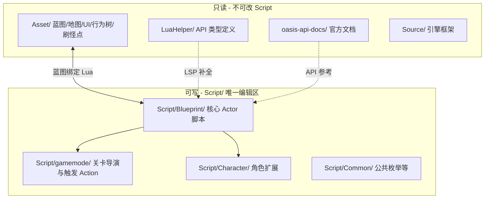
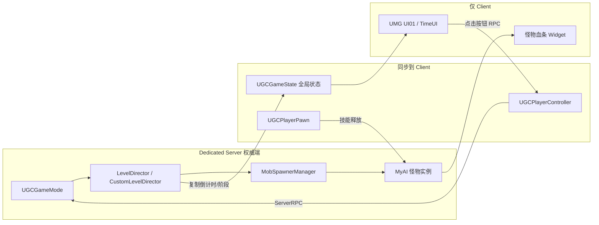
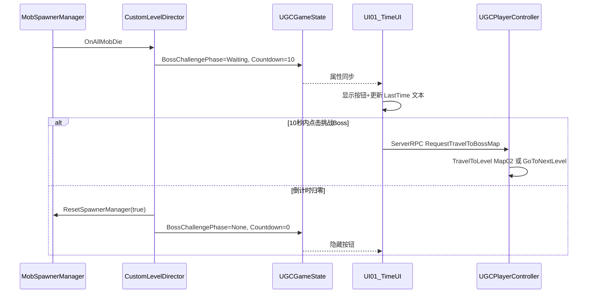

# 绿洲启元 demo1 架构讲解与双关 PVE 实现方案

## 一、项目整体架构

绿洲启元 UGC 项目采用 **Unreal Engine + Lua 脚本绑定蓝图** 的模式。逻辑不在 `require` 模块树里跑，而是 **每个蓝图类对应 `Script/` 下的一份 Lua 表**，引擎在生命周期事件里回调。



### 1. 目录职责

| 目录 | 职责 | 本项目中现状 |
|------|------|-------------|
| [`Script/Blueprint/`](d:\WeGameApps\rail_apps\OasisEraEditor(2001776)\ShadowTrackerExtra\UGCProjects\demo1\Script\Blueprint) | GameMode / GameState / PlayerController / Pawn / UI / AI / 技能模板 | 核心玩法脚本集中处 |
| [`Script/gamemode/`](d:\WeGameApps\rail_apps\OasisEraEditor(2001776)\ShadowTrackerExtra\UGCProjects\demo1\Script\gamemode) | 关卡导演、模式编辑器 Action | [`BP_CustomLevelDirector.lua`](d:\WeGameApps\rail_apps\OasisEraEditor(2001776)\ShadowTrackerExtra\UGCProjects\demo1\Script\gamemode\BP_CustomLevelDirector.lua) 已有 AI 死亡计数 |
| [`Script/Character/`](d:\WeGameApps\rail_apps\OasisEraEditor(2001776)\ShadowTrackerExtra\UGCProjects\demo1\Script\Character) | 玩家角色扩展 | [`BP_MyCharacter.lua`](d:\WeGameApps\rail_apps\OasisEraEditor(2001776)\ShadowTrackerExtra\UGCProjects\demo1\Script\Character\BP_MyCharacter.lua) 基本为空 |
| [`Script/GameAttribute/`](d:\WeGameApps\rail_apps\OasisEraEditor(2001776)\ShadowTrackerExtra\UGCProjects\demo1\Script\GameAttribute) | 属性名枚举 | `Health` / `HealthMax` 等 |
| [`Asset/`](d:\WeGameApps\rail_apps\OasisEraEditor(2001776)\ShadowTrackerExtra\UGCProjects\demo1\Asset) | 地图、UMG、怪物蓝图、行为树、刷怪点、技能资源 | **编辑器配置为主**，与 Script 成对 |
| [`LuaHelper/`](d:\WeGameApps\rail_apps\OasisEraEditor(2001776)\ShadowTrackerExtra\Content\LuaHelper) | 只读 API 类型 | 如 `AUGCMobSpawnerManager:ResetSpawnerManager` |
| [`oasis-api-docs/`](d:\WeGameApps\rail_apps\OasisEraEditor(2001776)\ShadowTrackerExtra\UGCProjects\demo1\oasis-api-docs) | 本地 API 文档 | 关卡/怪物/UI/技能查阅 |

### 2. 运行时模块划分（DS / Client）

参考 [`058_绿洲启元玩法开发框架介绍.md`](d:\WeGameApps\rail_apps\OasisEraEditor(2001776)\ShadowTrackerExtra\UGCProjects\demo1\oasis-api-docs\进阶内容\058_绿洲启元玩法开发框架介绍.md)：



| 模块 | 类 / 脚本 | 职责 |
|------|-----------|------|
| 玩法流程 | `UGCGameMode` → [`UGCGameMode.lua`](d:\WeGameApps\rail_apps\OasisEraEditor(2001776)\ShadowTrackerExtra\UGCProjects\demo1\Script\Blueprint\UGCGameMode.lua) | DS 最早启动；启用关卡流、刷怪、胜负 |
| 全局同步 | `UGCGameState` → [`UGCGameState.lua`](d:\WeGameApps\rail_apps\OasisEraEditor(2001776)\ShadowTrackerExtra\UGCProjects\demo1\Script\Blueprint\UGCGameState.lua) | 复制倒计时、阶段 enum；Client 加载主 UI |
| 关卡导演 | `BP_CustomLevelDirector` → [`BP_CustomLevelDirector.lua`](d:\WeGameApps\rail_apps\OasisEraEditor(2001776)\ShadowTrackerExtra\UGCProjects\demo1\Script\gamemode\BP_CustomLevelDirector.lua) | 监听清怪、触发 Boss 挑战 UI、超时重置 |
| 玩家控制 | `UGCPlayerController` → [`UGCPlayerController.lua`](d:\WeGameApps\rail_apps\OasisEraEditor(2001776)\ShadowTrackerExtra\UGCProjects\demo1\Script\Blueprint\UGCPlayerController.lua) | Client→DS RPC（传送、技能请求） |
| 玩家角色 | `UGCPlayerPawn` → [`UGCPlayerPawn.lua`](d:\WeGameApps\rail_apps\OasisEraEditor(2001776)\ShadowTrackerExtra\UGCProjects\demo1\Script\Blueprint\UGCPlayerPawn.lua) | HP、技能组件 `UAESkillManagerComponent` |
| 怪物 | `MyAI` + `MyAIController` | 受击/死亡、行为树驱动 |
| UI | `UI01` + `TimeUI` | 倒计时文本、【挑战 Boss】按钮 |
| 技能 | `BP_MyFireSkill` → [`BP_MyFireSkill.lua`](d:\WeGameApps\rail_apps\OasisEraEditor(2001776)\ShadowTrackerExtra\UGCProjects\demo1\Script\Blueprint\Prefabs\Skills\BP_MyFireSkill.lua) | 火焰范围伤害 + CD |

**绑定规则**：Lua 通过 `---@class X_C:ParentClass` 声明父类，`return` 的表会被引擎 merge 到蓝图实例；资源路径统一用 `UGCMapInfoLib.GetRootLongPackagePath() .. "Asset/..."` 拼接。

---

## 二、需求 a：两关不相通

「不相通」= 玩家不能步行从 A 关走到 B 关。有两种官方做法：

### 方案 A — 独立地图（demo1 已部分实现）

- **编辑器**：小怪关 `Map01`，Boss 关 `Map02`（项目已有 `/demo1/Map02` 引用）
- **切换 API**：`UGCMapInfoLib.TravelToLevel("/demo1/Map02")`
- **现有代码**：[`UI01.lua`](d:\WeGameApps\rail_apps\OasisEraEditor(2001776)\ShadowTrackerExtra\UGCProjects\demo1\Script\Blueprint\UI\UI01.lua) + [`UGCPlayerController:RequestTravelToBossMap`](d:\WeGameApps\rail_apps\OasisEraEditor(2001776)\ShadowTrackerExtra\UGCProjects\demo1\Script\Blueprint\UGCPlayerController.lua)
- **优点**：两关物理完全隔离，配置简单
- **缺点**：整图切换，重置小怪关需 `TravelToLevel` 回 Map01 或在 Map01 内做刷怪重置

### 方案 B — 关卡流 LevelFlow（官方 PVE 推荐）

- **编辑器**：主关卡 + 2 个子关卡；每关一个 `UGCLevelActor`；`UGCLevelActorMgr` 定义顺序
- **启动**：`UGCGameMode:ReceiveBeginPlay` 中 `UGCLevelFlowSystem.EnableLevelFlow(MgrPath)`
- **切换**：`UGCLevelFlowSystem.GoToNextLevelForOnePlayer(PlayerController)` 传送到下一子关卡出生点
- **优点**：同一局内阶段管理、计分、结算一体化（见 [`219_关卡管理.md`](d:\WeGameApps\rail_apps\OasisEraEditor(2001776)\ShadowTrackerExtra\UGCProjects\demo1\oasis-api-docs\玩法案例及模板\219_关卡管理.md)）
- **缺点**：编辑器配置量更大

**推荐**：若只做单人 PVE、且 demo1 已有 Map02，可继续 **方案 A**；若后续要多关、计分、结算，迁移到 **方案 B**。

---

## 三、需求 b：小怪 5 米感知 + 攻击 + 血条

### 编辑器配置（Asset/，非 Script）

1. **怪物蓝图**（绑定 [`MyAI.lua`](d:\WeGameApps\rail_apps\OasisEraEditor(2001776)\ShadowTrackerExtra\UGCProjects\demo1\Script\Blueprint\AI\MyAI.lua)）
   - 父类：`STExtraSimpleCharacter`
   - AIController：[`MyAIController.lua`](d:\WeGameApps\rail_apps\OasisEraEditor(2001776)\ShadowTrackerExtra\UGCProjects\demo1\Script\Blueprint\AI\MyAIController.lua) → 行为树 `Asset/Blueprint/AI/MyBehaviortree`
   - 实体类型：`EntityType.Monster`

2. **5 米发现玩家**（500 cm）
   - 怪物逻辑管理组件 → `BP_UGCTargetProducer_EnemyHatred` → **寻敌感知半径 = 500**
   - 可选：**锁定玩家时显示** 血条（见 [`113_怪物逻辑管理组件.md`](d:\WeGameApps\rail_apps\OasisEraEditor(2001776)\ShadowTrackerExtra\UGCProjects\demo1\oasis-api-docs\进阶内容\113_怪物逻辑管理组件.md)）
   - 关卡内放置 **AI World Volume** + 烘焙 NavMesh（[`110_导航网格.md`](d:\WeGameApps\rail_apps\OasisEraEditor(2001776)\ShadowTrackerExtra\UGCProjects\demo1\oasis-api-docs\进阶内容\110_导航网格.md)）

3. **攻击行为**
   - 默认行为树 `BT_UGC_GenericMob_MainTree` 已含寻敌→追击→攻击
   - 行为树寻敌节点目标类型设为 `UGCPlayerPawn`（[`125_让怪物移动起来.md`](d:\WeGameApps\rail_apps\OasisEraEditor(2001776)\ShadowTrackerExtra\UGCProjects\demo1\oasis-api-docs\进阶内容\125_让怪物移动起来.md)）

4. **血条**
   - 创建继承 `UGC_NPC_Generic_HealthBar_UIBP` 的血条 Widget（Asset）
   - 怪物蓝图 Health Bar → **控件蓝图路径** + **实时显示最大距离 CM**（如 2000~5000）
   - HP 走属性系统 `Health` / `HealthMax`（[`104_怪物血条.md`](d:\WeGameApps\rail_apps\OasisEraEditor(2001776)\ShadowTrackerExtra\UGCProjects\demo1\oasis-api-docs\进阶内容\104_怪物血条.md)）
   - **无需 Script 写血条 UI**，引擎自动挂载 3D 血条

5. **刷怪**
   - 小怪关放置 `BP_UGCMobSpawner` 或 `BP_UGCMobSpawnerManager`（[`116_怪物刷新器.md`](d:\WeGameApps\rail_apps\OasisEraEditor(2001776)\ShadowTrackerExtra\UGCProjects\demo1\oasis-api-docs\进阶内容\116_怪物刷新器.md)）
   - 监听 `OnAllMobDie` 作为「清关」信号（比手动数死亡更稳）

### Script 侧（可选增强）

[`MyAI.lua`](d:\WeGameApps\rail_apps\OasisEraEditor(2001776)\ShadowTrackerExtra\UGCProjects\demo1\Script\Blueprint\AI\MyAI.lua) 已有 `BPDie` → `LuaQuickFireEvent("OnAIDeath")`；建议 **LevelDirector 改听 Spawner 的 `OnAllMobDie`**，避免与 [`BP_CustomLevelDirector`](d:\WeGameApps\rail_apps\OasisEraEditor(2001776)\ShadowTrackerExtra\UGCProjects\demo1\Script\gamemode\BP_CustomLevelDirector.lua) 里硬编码 `>= 3` 不一致。

---

## 四、需求 c + d：清怪后 10 秒倒计时 + 挑战 Boss + 超时重置

### 现状与缺口

[`BP_CustomLevelDirector.lua`](d:\WeGameApps\rail_apps\OasisEraEditor(2001776)\ShadowTrackerExtra\UGCProjects\demo1\Script\gamemode\BP_CustomLevelDirector.lua) 已实现雏形：

```lua
-- 清 3 只怪 → 10 秒计时 + 显示按钮（预制接口）
UGCTemplateGameplayStatics:CreateTimer("BossCountdown", 10)
UIManager:SetWidgetVisibility("ChallengeBossButton", true)
```

缺口：
- 倒计时 **UI 数字** 未接入（[`TimeUI.lua`](d:\WeGameApps\rail_apps\OasisEraEditor(2001776)\ShadowTrackerExtra\UGCProjects\demo1\Script\Blueprint\UI\TimeUI.lua) 为空壳）
- **超时重置** 逻辑缺失
- **按钮隐藏** 与 **刷怪重置** 未串联

### 推荐数据流



### 关键实现点

| 步骤 | 位置 | 做法 |
|------|------|------|
| 阶段状态 | `UGCGameState` | 复制 int：`BossCountdown`、`BossChallengeActive` |
| 倒计时驱动 | DS：`CustomLevelDirector` | `K2_SetTimerDelegateForLua` 每秒 `Countdown--`；到 0 调 `ResetLevel()` |
| UI 展示 | Client：`UI01` / `TimeUI` | `Construct` 读 GameState；`SetText` 更新 `LastTime`；控制 `BossButton` 可见性 |
| 点击传送 | 已有 [`UI01:OnBossButtonClicked`](d:\WeGameApps\rail_apps\OasisEraEditor(2001776)\ShadowTrackerExtra\UGCProjects\demo1\Script\Blueprint\UI\UI01.lua) | 保持 Client→`RequestTravelToBossMap`→DS 执行 |
| 超时重置 | DS：`CustomLevelDirector:ResetLevel()` | ① `AUGCMobSpawnerManager:ResetSpawnerManager(true)` ② `StartSpawnerManager()` ③ 重置 `AIDeathCount` ④ GameState 清 UI 状态 |
| 防重复 UI | 统一入口 | 去掉 `UGCGameState` 与 `updateUI` Action 双重加载 UI01 的重复路径 |

---

## 五、需求 e：5 米圆形火焰 + 2 秒 CD

### 编辑器（技能系统为主）

1. **技能模板** [`BP_MyFireSkill`](d:\WeGameApps\rail_apps\OasisEraEditor(2001776)\ShadowTrackerExtra\UGCProjects\demo1\Script\Blueprint\Prefabs\Skills\BP_MyFireSkill.lua)（`PESkillTemplate_Base_C`）
   - **BaseData → Interval = 2**（CD 2 秒）
   - 技能阶段添加 Task：**生成法术场** → 选用 **伤害场** 模板
   - 法术场 **SphereCollision 半径 = 500 cm**（5 米）
   - 伤害 Task 过滤 `EntityType.Monster`（[`088_法术场.md`](d:\WeGameApps\rail_apps\OasisEraEditor(2001776)\ShadowTrackerExtra\UGCProjects\demo1\oasis-api-docs\进阶内容\088_法术场.md)）

2. **注册到玩家**
   - `UGCPlayerPawn` 蓝图：`SkillArchetypes` / `Skill Entry Configs` 挂载火焰技能
   - 或在 `UGCGameState.UGCSkillPaths` 全局注册（[`068_快速入门.md`](d:\WeGameApps\rail_apps\OasisEraEditor(2001776)\ShadowTrackerExtra\UGCProjects\demo1\oasis-api-docs\进阶内容\068_快速入门.md)）

3. **释放入口**（二选一）
   - **输入映射**：按键 → `UAESkillManagerComponent:TriggerEvent(Index, UTSkillEventType.SET_KEY_DOWN)`
   - **UI 按钮**：`UGCInputSystem.InjectInputMapping` 或 ServerRPC → Pawn 上 TriggerEvent

4. **CD 表现**
   - 引擎按 Interval 自动拦截；UI 可选读技能 CD Task 或自定义冷却遮罩

### Script 侧（薄封装）

- [`BP_MyFireSkill.lua`](d:\WeGameApps\rail_apps\OasisEraEditor(2001776)\ShadowTrackerExtra\UGCProjects\demo1\Script\Blueprint\Prefabs\Skills\BP_MyFireSkill.lua)：在 `CastSkill_Entry` 打日志或播放额外特效即可，**伤害逻辑交给技能编辑器 Task**
- 若需脚本手动范围伤害（不推荐，与技能 CD 重复）：`UGCEntityTypeSystem.OverlapSphereByEntityType` + `UGCGameSystem.ApplyDamage`

---

## 六、按需求汇总：关键类与 API

| 需求 | 关键类 / API | 配置位置 |
|------|-------------|---------|
| a 两关隔离 | `UGCLevelFlowSystem` / `UGCMapInfoLib.TravelToLevel` | Asset 地图或 LevelActorMgr + Script GameMode/Director |
| b 5m 感知攻击 | `BP_UGCTargetProducer_EnemyHatred`（500cm）、`MyAIController`、行为树 | Asset 怪物 + 行为树 |
| b 血条 | `UGC_NPC_Generic_HealthBar_UIBP`、`Health`/`HealthMax` | Asset 怪物 Health Bar |
| c 倒计时+按钮 | `UGCGameState`（复制）、`UI01`/`TimeUI`、`UGCPlayerController` RPC | Script + Asset UMG |
| d 超时重置 | `AUGCMobSpawnerManager:ResetSpawnerManager` / `StartSpawnerManager` | Script Director + Asset 刷怪管理器 |
| e 火焰技能 | `BP_MyFireSkill`、`UAESkillManagerComponent`、法术场伤害场（R=500, CD=2） | Asset 技能编辑器 + Script 薄层 |

---

## 七、建议实施顺序

1. **编辑器**：Map01 小怪关布局 + 刷怪管理器 + 怪物蓝图（感知 500cm + 血条）；Map02 Boss 关
2. **Script**：扩展 `BP_CustomLevelDirector`（`OnAllMobDie`、倒计时、超时 `ResetLevel`）
3. **Script**：`UGCGameState` 增加复制字段；完善 `TimeUI` 倒计时显示；整理 `UI01` 按钮显隐
4. **Script**：确认 `UGCPlayerController` 传送 RPC（Map02 或 LevelFlow）
5. **编辑器 + Script**：配置 `BP_MyFireSkill` 法术场（5m/2s CD）并挂到 `UGCPlayerPawn`
6. **联调**：DS 清怪 → Client UI → 点击传送 / 超时刷怪重置 → 火焰技能打怪验证

### 与现有 demo1 的关系

项目已是「Boss 挑战 + 地图切换」样例，**最大增量**是：① 用 Spawner 事件替代硬编码 3 只怪；② 补全 `TimeUI` 与超时重置；③ 在编辑器完成怪物感知/血条/火焰技能配置。框架层 [`UGCGameMode.lua`](d:\WeGameApps\rail_apps\OasisEraEditor(2001776)\ShadowTrackerExtra\UGCProjects\demo1\Script\Blueprint\UGCGameMode.lua) 可从 stub 激活，用于 `EnableLevelFlow`（若选方案 B）。
